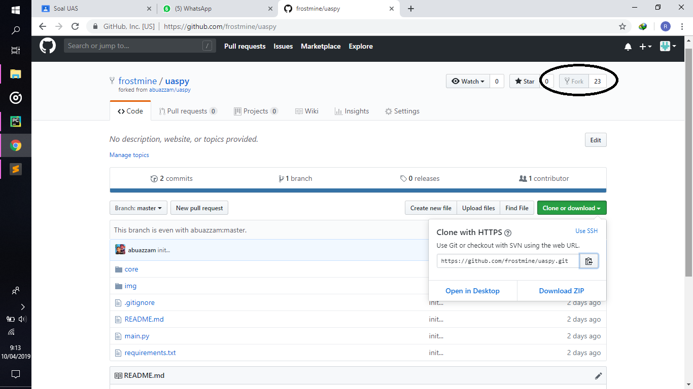
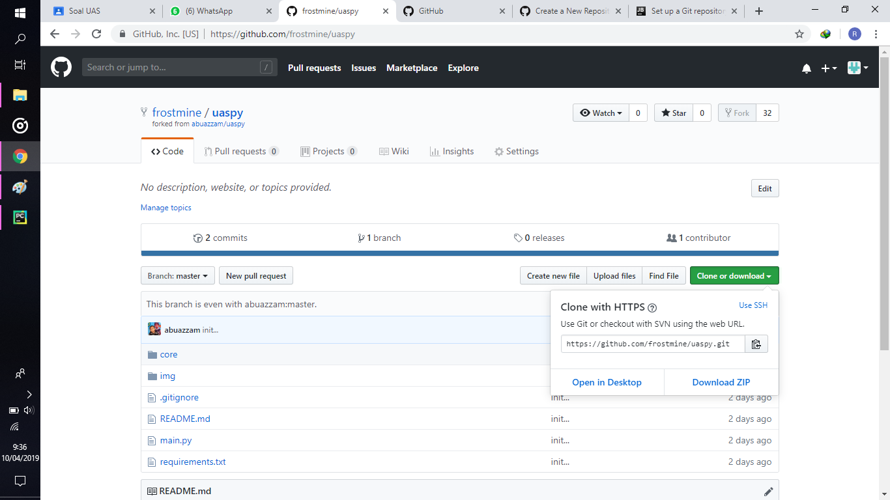
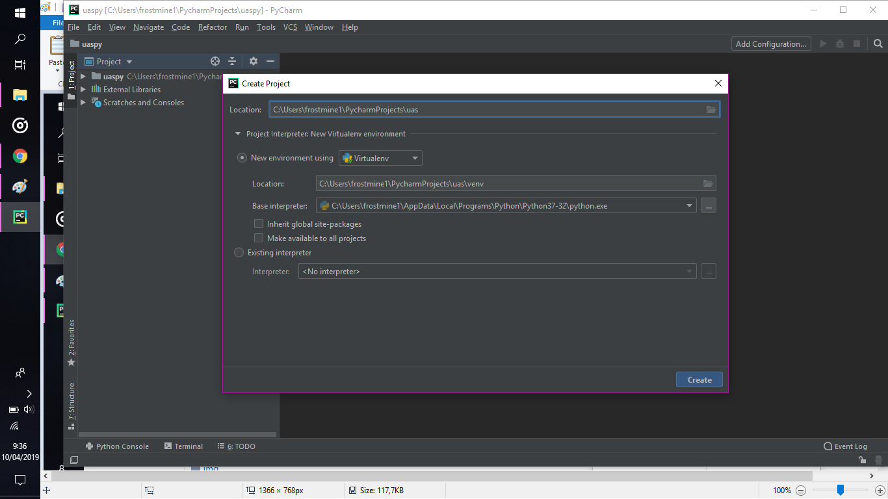
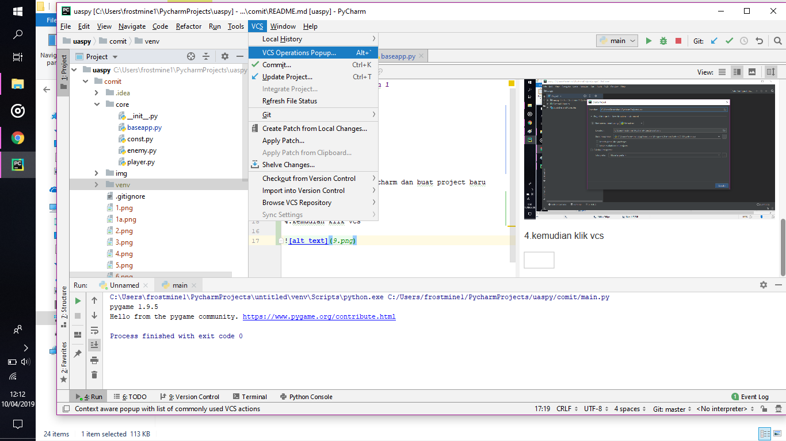
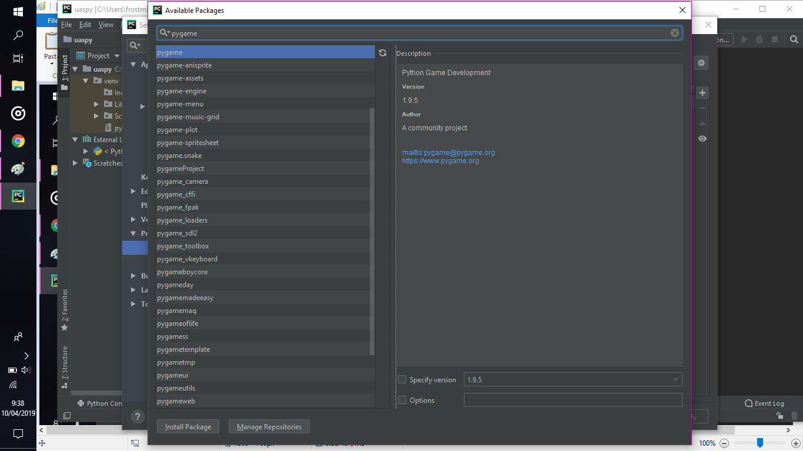
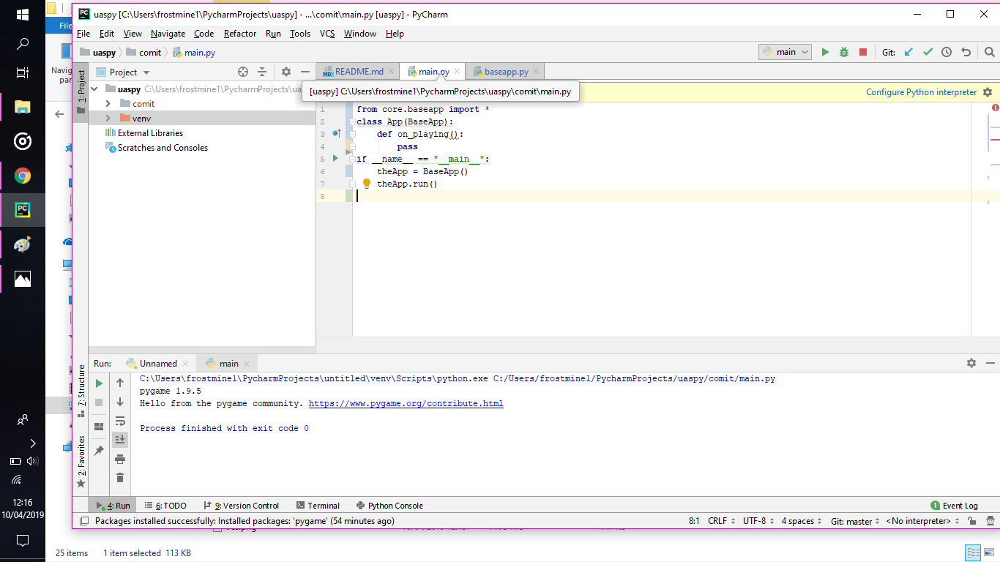
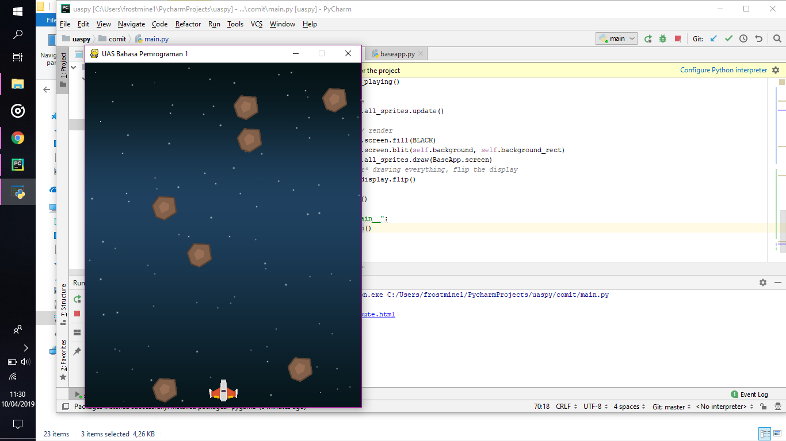

# UAS Bahasa Pemrograman 1

1.Pertama kita fork

2. kita clone

3.kemudian kita buka pycharm dan buat project baru

4.kemudian klik vcs , git clone

5.Setelah selesai kita tambahkan pygame

6.Kemudian kita import baseapp ke main

7.Setelah itu kita jalankan programnya

